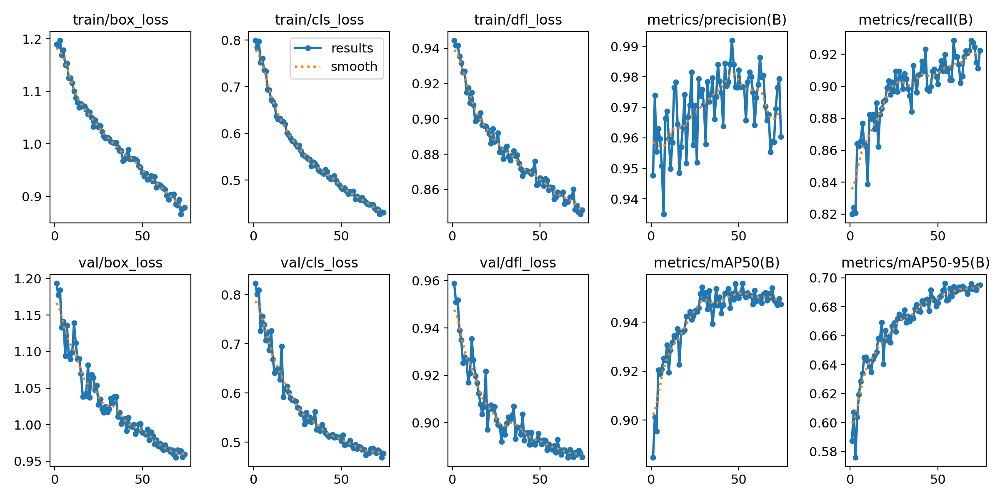
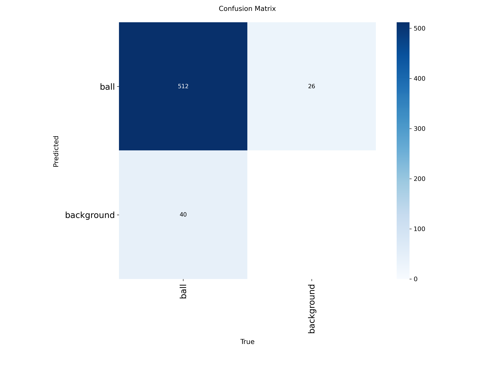
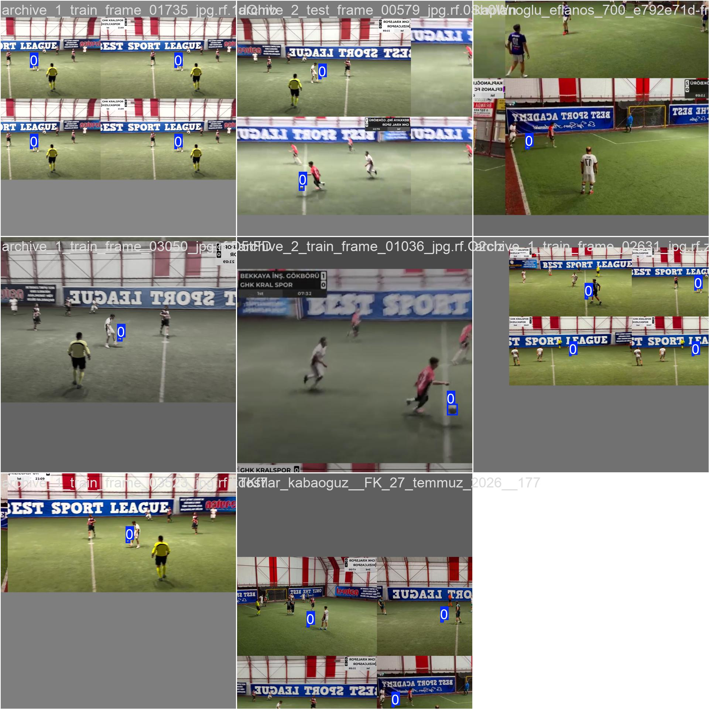
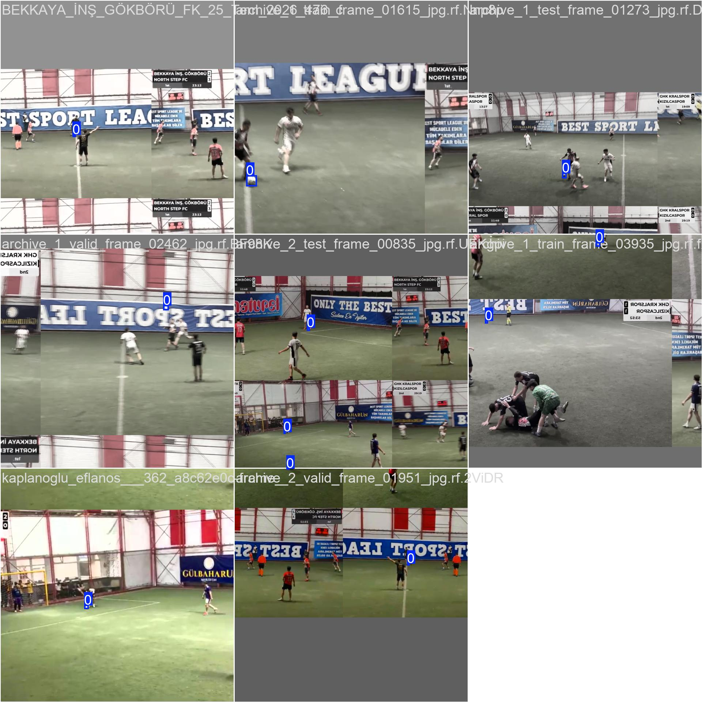

# PitchVision-AI ⚽🤖

Halı saha futbol maçları için geliştirilen, uçtan uca bilgisayarlı görü (computer vision) ve otomatik etiketleme (auto-labeling) boru hattı (pipeline) projesidir. Bu repo; oyuncu takibi, veri seti hazırlama süreçleri ve derin öğrenme modellerinin entegrasyonunu amaçlar.

## 👥 Proje Ekibi & Katkı Verenler
* **Emirhan Uludogan**
* **Şevval Yavuz**
* **Enes Ketenci**

---

## 📂 Proje Yapısı
- `/docs/workflows`: Etiketleme sistemleri ve iş akışı dokümantasyonları.
- `/docs/eval_results`: Model eğitim metrikleri, başarım grafikleri ve doğrulama görselleri.
- `/models/ball_tracking_model`: Eğitilmiş YOLO model ağırlıkları (`best.pt`) ve model yapılandırmaları.
- `/src`: Ana Python kaynak kodları, veri işleme ve çıkarım scriptleri.
- `/notebooks`: Kaggle çalışmaları, deneysel notebook'lar ve prototipler.
- `/data`: Veri setleri (Git tarafından takip edilmez, yerel tutulmalıdır).

---

## 🚀 Model Performansı ve Eğitim Metrikleri (`train_master_final`)

YOLOv8 mimarisi kullanılarak 5.763 etiketli görsel üzerinden gerçekleştirilen antrenman süreçlerine ait başarım ve kayıp eğrileri aşağıdadır:

### 1. Eğitim ve Doğrulama Sonuçları (Results)
Eğitim boyunca kayıp (loss) ve doğruluk (mAP) metriklerinin değişim grafiği:


### 2. Karmaşıklık Matrisi (Confusion Matrix)
Sınıf tahminlerindeki başarı ve hata oranlarının matris dağılımı:


### 3. Eğitim Batch Örnekleri
Modelin eğitime girdi olarak aldığı örnek kareler:
| Batch 0 Örneği | Batch 1 Örneği |
| :---: | :---: |
|  |  |

---

## 🛠️ İlk Kurulum ve Çalışma Rehberi

Projeyi yerel ortamınıza klonlamak ve çalıştırmak için aşağıdaki adımları izleyebilirsiniz:

1. **Repoyu klonlayın:**
   ```bash
   git clone [https://github.com/emirhanuludogan/PitchVision-AI.git](https://github.com/emirhanuludogan/PitchVision-AI.git)
   cd PitchVision-AI